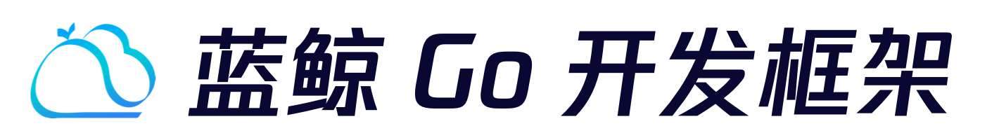

---

  

简体中文 | [English](README_EN.md)

> 注意: main 分支在开发过程中可能处于不可用状态，请通过 [Releases](https://github.com/TencentBlueKing/blueapps-go/releases) 去获取稳定版本代码。

蓝鲸 Go 开发框架基于 [Gin](https://gin-gonic.com/zh-cn/docs/) & [蓝鲸 PaaS 平台](https://github.com/TencentBlueKing/blueking-paas) 的能力，通过集成统一登录，云 API，对象存储等服务，帮助 SaaS 开发者快速开发 Web 服务。

## 功能特性

蓝鲸 Go 开发框架推出全新版本，包含以下特性：

- 全新设计的 Demo 功能，直观展示框架能力，助力开发者快速上手体验
- 内置统一登录，支持用户身份认证 & 基础的 API 访问权限控制
- 集成 MySQL、Redis、对象存储（bk-repo）等平台提供的增强服务
- 集成 GORM 组件，支持数据库加密、版本控制及多级缓存机制
- 内置定时 / 异步任务框架，支持任务调度，降低复杂任务开发成本
- 无缝集成蓝鲸可视化能力，提供实时监控看板 & APM 性能追踪
- 自动生成 Swagger API 接口文档 & 支持多语言国际化（i18n）
- 支持通过蓝鲸 Buildpack 或 Dockerfile 构建模式部署

## 快速开始

开发者可以通过阅读 [开发使用指南](docs/DEVELOP_GUIDE.md) 来了解如何快速上手使用蓝鲸 Go 开发框架。

## 支持

- [PaaS 产品白皮书](https://bk.tencent.com/docs/markdown/ZH/PaaS/1.0/UserGuide/Overview/README.md)
- [蓝鲸智云 - 学习社区](https://bk.tencent.com/s-mart/community)
- [蓝鲸 DevOps 在线视频教程](https://bk.tencent.com/s-mart/video)
- 蓝鲸社区版交流 QQ 群：495299374
- 蓝鲸运维开发交流 QQ 群：878501914

## 蓝鲸社区

- [BK-PaaS](https://github.com/TencentBlueKing/blueking-paas)：蓝鲸 PaaS 平台是开放式的开发平台，让开发者可以方便快捷地创建、开发、部署和管理 SaaS 应用。
- [BK-APIGW](https://github.com/TencentBlueKing/blueking-apigateway)：蓝鲸 API 网关是高性能，高可用的 API 托管服务，帮助开发者创建、发布、维护、监控和保护 API。
- [BK-CI](https://github.com/TencentBlueKing/bk-ci)：蓝鲸持续集成平台是一个开源的持续集成和持续交付系统，可以轻松将你的研发流程呈现到你面前。
- [BK-BCS](https://github.com/TencentBlueKing/bk-bcs)：蓝鲸容器管理平台是以容器技术为基础，为微服务业务提供编排管理的基础服务平台。
- [BK-SOPS](https://github.com/TencentBlueKing/bk-sops)：标准运维（SOPS）是通过可视化的图形界面进行任务流程编排和执行的系统。
- [BK-JOB](https://github.com/TencentBlueKing/bk-job)：蓝鲸作业平台（Job）是一套运维脚本管理系统，具备海量任务并发处理能力。
- [BK-CMDB](https://github.com/TencentBlueKing/bk-cmdb)：蓝鲸配置平台是一个面向资产及应用的企业级配置管理平台。

## 贡献

如果你有好的意见或建议，欢迎给我们提 Issues 或 PullRequests，为蓝鲸开源社区贡献力量。关于分支、Issue 及 PR，请查看 [代码贡献指南](docs/CONTRIBUTING.md)。

[腾讯开源激励计划](https://opensource.tencent.com/contribution) 鼓励开发者的参与和贡献，期待你的加入。

## 协议

本项目基于 MIT 协议，详细请参考 [LICENSE](LICENSE)
