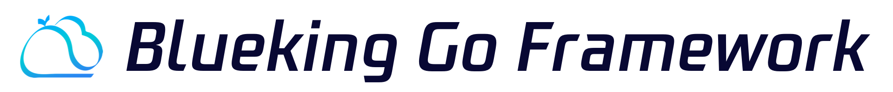

---  

  

[简体中文](README.md) | English

> Note: The main branch may be unstable during development. For stable releases, please refer to [Releases](https://github.com/TencentBlueKing/blueapps-go/releases).

The BlueKing Go Development Framework leverages the capabilities of [Gin](https://gin-gonic.com/en/docs/) and the [BK-PaaS](https://github.com/TencentBlueKing/blueking-paas). By integrating services such as unified login, cloud APIs, and object storage, it helps SaaS developers rapidly build web services.

## Features

The BlueKing Go Development Framework introduces a new version with the following features:

- Redesigned Demo: Intuitively showcases framework capabilities to accelerate developer onboarding.
- Authentication: Built-in unified login, supporting user authentication & basic api access control.
- Enhanced Services: Integrated support for MySQL, Redis, and Object Storage (bk-repo) provided by the platform.
- GORM Integration: Supports database encryption, version control, and multi-level caching mechanisms.
- Task Framework: Built-in scheduled/asynchronous task scheduling to reduce complex task development costs.
- Visualization: Seamless integration with BlueKing’s monitoring tools for real-time dashboards and APM performance tracing.
- API & i18n: Automatically generates Swagger API documentation and supports multilingual internationalization (i18n).
- Deployment Flexibility: Supports deployment via BlueKing Buildpack or Dockerfile.

## Getting Started

Developers can refer to the [Develop Guide (In Chinese)](docs/DEVELOP_GUIDE.md) to quickly start using the BlueKing Go Development Framework.

## Support

- [PaaS Product Whitepaper](https://bk.tencent.com/docs/markdown/ZH/PaaS/1.0/UserGuide/Overview/README.md)
- [BlueKing Learning Community](https://bk.tencent.com/s-mart/community)
- [BlueKing DevOps Video Tutorials](https://bk.tencent.com/s-mart/video)
- BlueKing Community Edition QQ Group: 495299374
- BlueKing Ops Development QQ Group: 878501914

## BlueKing Community

- [BK-PaaS](https://github.com/TencentBlueKing/blueking-paas): Open development platform for creating, deploying, and managing SaaS applications.
- [BK-APIGW](https://github.com/TencentBlueKing/blueking-apigateway): High-performance API gateway for creating, publishing, and securing APIs.
- [BK-CI](https://github.com/TencentBlueKing/bk-ci): Open-source CI/CD system for streamlining development workflows.
- [BK-BCS](https://github.com/TencentBlueKing/bk-bcs): Container management platform for microservice orchestration.
- [BK-SOPS](https://github.com/TencentBlueKing/bk-sops): Visual task orchestration and execution system.
- [BK-JOB](https://github.com/TencentBlueKing/bk-job): Script management system for large-scale task processing.
- [BK-CMDB](https://github.com/TencentBlueKing/bk-cmdb): Enterprise-grade configuration management platform for assets and applications.

## Contribution

We welcome contributions via [Issues](https://github.com/TencentBlueKing/blueapps-go/issues) or [PullRequests](https://github.com/TencentBlueKing/blueapps-go/pulls). For guidelines, see [CONTRIBUTING](docs/CONTRIBUTING_EN.md).

Join the [Tencent OpenSource Plan](https://opensource.tencent.com/contribution) to participate in open-source development.

## License

This project based on the MIT License. For details, see LICENSE.